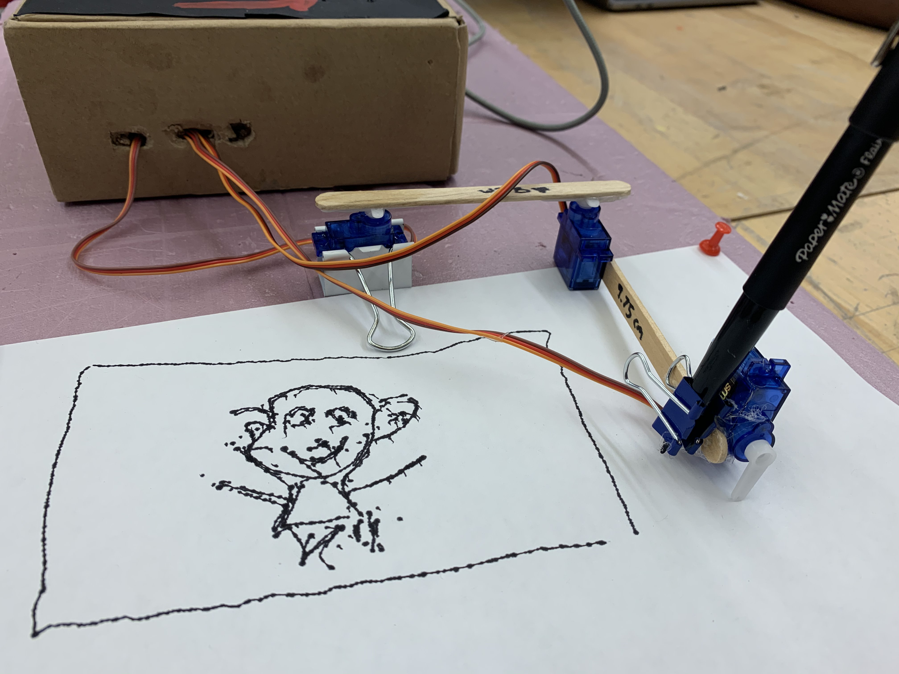
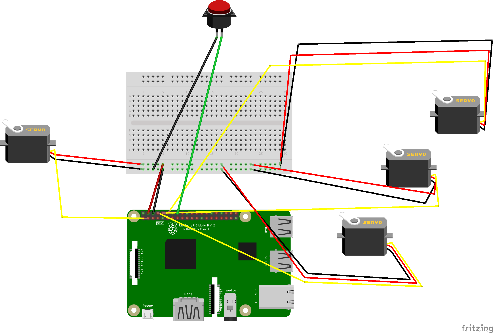
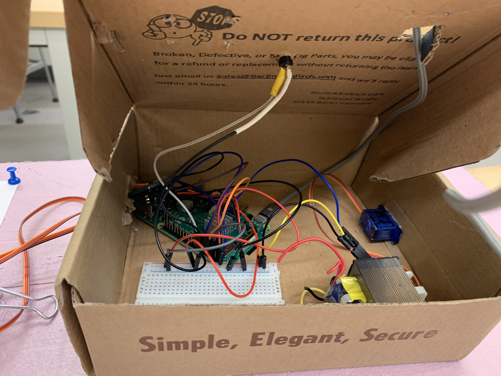

# The Servo Scribbler

Welcome! For module 4/5 of Creative Embedded Systems we were tasked with actuating the world by making creative interactive kinetic art while using motors. We (Justin Cong and Jordan Smith) decided to create a machine that takes and img file and prints it physically on paper using a writing utensil of choice. [Check out a timelapse of the Servo Scribbler creating it](https://www.youtube.com/watch?v=3DlbCSYaHHQ&feature=youtu.be), or a l[onger video of the whole process](https://www.youtube.com/watch?v=EVQ3myf2Xe4&feature=youtu.be).

 

## Setup 

### Necessary Hardware
- Raspberry Pi Model 3 B+ (though other models will likely work)
- Momentary push button (soldered)
- 4 servo motors (and the plastic hubs)
- Breadboard

### Other things...
- Three popsicle sticks
- Cardboard box (or other enclosure)
- Hot glue gun
- A platform of sorts (we chose styrofoam)
- Thumbtacks (to keep the paper in place)

### Hardware Setup

Here is a hookup guide of the electronics:
 

Here's a picture of the actual setup:

#### Breadboard
- Hook up the 5V and GND pinouts to the breadboard (we have a lot of motors that need power!)

#### Servo Motor 1 (shoulder of the printer)
- GND: Connected to the breadboard.
- 5V: Connected to the breadboard.
- Pulse: Connected to the Raspberry Pi GPIO pin 14.

#### Servo Motor 2 (elbow of the printer)
- GND: Connected to the breadboard.
- 5V: Connected to the breadboard.
- Pulse: Connected to the Raspberry Pi GPIO pin 15.

#### Servo Motor 3 (raises the pen and lowers it)
- GND: Connected to the breadboard.
- 5V: Connected to the breadboard.
- Pulse: Connected to the Raspberry Pi GPIO pin 18.

#### Servo Motor 4 (the "Done!" flag)
- GND: Connected to the breadboard.
- 5V: Connected to the breadboard.
- Pulse: Connected to the Raspberry Pi GPIO pin 2.

#### Momentary Push Button
- GND: Connected to the breadboard.
- Input: Connected to GPIO pin 23. 

#### The Printer Itself
In order to create the printer itself, see [the documentation on Brachio Graph](https://brachiograph.readthedocs.io/en/latest/)

### Software to Install 

### Processing
Download Processing [here](https://processing.org/)

#### BrachioGraph
Again, check out the [Brachio Graph documentation](https://brachiograph.readthedocs.io/en/latest/). You can also simply `pip install -r requirements.txt`, we have all the necessary requirements on there.  

In order to re-create our work one would need: A Raspberry Pi 3 B+, four servo motors, three popsicle sticks, two binder clips (one small and one large), a breadboard, a switch, access to Python, and access to processing.

### Running it
1. Connect the Raspberry Pi to a monitor, keyboard, and mouse (or use a remote desktop like VNC Viewer).
2. On a terminal, run `sudo pigpiod`, then navigate to the repo. Run `cd BrachioGraph` and then run `python3 controller.py`. This will set the printer up and make it ready to receive an image to print.
2. Open the Processing sketch underneath `BrachioGraph/DrawSomethingKeys`
3. Draw something! 
4. Hit `s` to save the drawing.
5. Hit the push button! 
6. Now we wait - hitting the push button tells the Pi to convert the image you just saved into a JSON file. This can take anywhere from 1-3 minutes. After it's created, it takes another 2-7 minutes for the Servo Scribbler to complete the drawing.
7. Enjoy!
